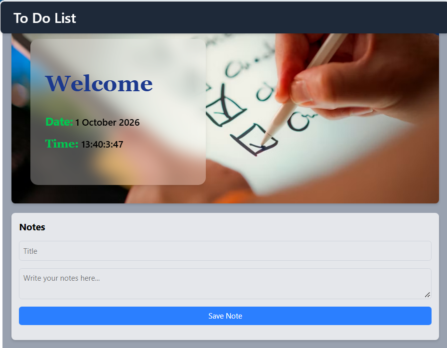
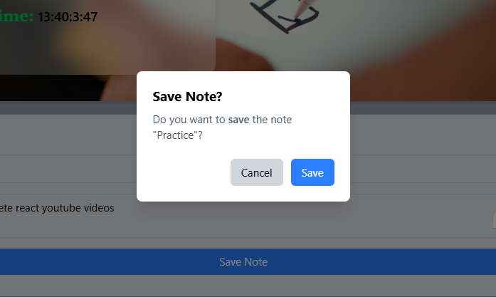
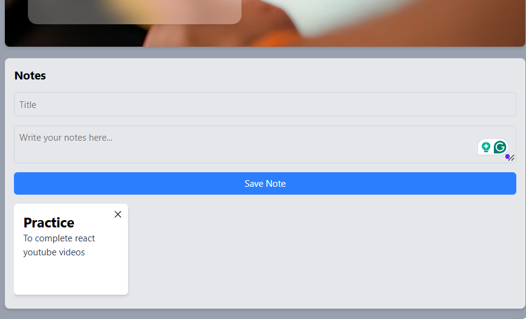

# 📝 Kaam — React To-Do & Notes App

A clean and responsive **To-Do / Notes web application** built with **React.js, Vite, and Tailwind CSS**.  
Kaam allows users to create notes/tasks, confirm before saving, and keep their saved notes available even after refreshing the browser using **Local Storage**.

---

## ✨ Features

- 📝 **Create Notes** — Add a title and detailed note content.
- 💾 **Local Storage Persistence** — Saved notes remain available after refreshing the page.
- 🔔 **Save Confirmation** — A custom confirmation modal asks the user to confirm before saving.
- 📋 **Note Cards** — Saved notes are displayed in clean, compact cards.
- 🕒 **Date & Time Display** — The welcome section displays the current date and time.
- 🎨 **Responsive UI** — Styled with Tailwind CSS for a clean and responsive interface.
- ⚡ **Fast Development** — Powered by Vite and React.
- 🧩 **Component-Based Architecture** — Built using reusable React components and hooks.
- 🔒 **No Backend Required** — Notes are stored locally in the user's browser.

---

## 📸 Screenshots

### 🏠 Home Screen

The main interface contains the application header, welcome section, current date/time, and the Notes form.



---

### 💬 Save Confirmation

Before saving a note, the application displays a confirmation dialog with **Cancel** and **Save** actions.



---

### 📋 Saved Notes

Once saved, the note is displayed as a card containing its title and content.



---

## 🛠️ Tech Stack

| Technology | Purpose |
|---|---|
| **React.js** | Building the user interface and managing application state |
| **Vite** | Development server and build tool |
| **JavaScript (ES6+)** | Application logic |
| **Tailwind CSS** | Responsive styling and UI design |
| **React Hooks** | State and lifecycle management |
| **Local Storage API** | Persistent browser-side data storage |
| **Lucide React** | Icons used in the interface |

The repository currently uses React 19, Vite 8, Tailwind CSS 4, and Lucide React. 

---

## ⚙️ React Concepts Used

### `useState`

Used to manage:

- Note title
- Note content
- Saved notes
- Confirmation modal visibility

Example:

```jsx
const [title, setTitle] = useState('');
const [content, setContent] = useState('');
const [tasks, setTasks] = useState([]);
const [showConfirm, setShowConfirm] = useState(false);
```

### `useEffect`

Used to automatically update Local Storage whenever the notes array changes:

```jsx
useEffect(() => {
  localStorage.setItem('tasks', JSON.stringify(tasks));
}, [tasks]);
```

### Local Storage

Notes are converted to JSON before being stored:

```jsx
localStorage.setItem('tasks', JSON.stringify(tasks));
```

When the application starts, previously saved notes are retrieved:

```jsx
const savedTasks = localStorage.getItem('tasks');
return savedTasks ? JSON.parse(savedTasks) : [];
```

This means users can refresh the page without losing their notes.

---

## 🔄 Application Flow

```text
User enters title + content
          ↓
      Save Note
          ↓
   Validate title
          ↓
 Confirmation Modal
      ↙       ↘
   Cancel     Save
                ↓
        Add note to state
                ↓
       Save to Local Storage
                ↓
       Display Note Card
```

---

## 📁 Project Structure

A typical project structure is:

```text
Kaam/
│
├── public/
│
├── src/
│   ├── assets/
│   ├── components/
│   ├── App.jsx
│   ├── main.jsx
│   └── ...
│
├── screenshots/
│   ├── home-screen.png
│   ├── save-confirmation.png
│   └── saved-note.png
│
├── .gitignore
├── eslint.config.js
├── index.html
├── package.json
├── package-lock.json
├── vite.config.js
└── README.md
```

> Your exact `src` structure may differ depending on how you have organized your components.

---

## 🚀 Getting Started

### 1. Clone the repository

```bash
git clone https://github.com/jasmeet-01/Kaam.git
```

### 2. Move into the project directory

```bash
cd Kaam
```

### 3. Install dependencies

```bash
npm install
```

### 4. Start the development server

```bash
npm run dev
```

Vite will provide a local development URL in the terminal, normally similar to:

```text
http://localhost:5173/
```

### 5. Build for production

```bash
npm run build
```

### 6. Preview the production build

```bash
npm run preview
```

---

## 💡 How to Use

1. Open the application.
2. Enter a title in the **Title** field.
3. Enter your note in the text area.
4. Click **Save Note**.
5. Confirm the action using the **Save** button.
6. Your note appears as a card below the form.
7. Refresh the page — the saved note remains available because it is stored in Local Storage.

---

## 🧠 Key Learning Outcomes

This project was built to practice practical React frontend development concepts, including:

- Functional components
- JSX
- `useState`
- `useEffect`
- Event handling
- Controlled form inputs
- Conditional rendering
- Array rendering with `.map()`
- Browser Local Storage
- JSON serialization and parsing
- Modal/confirmation UI
- Tailwind CSS utility classes
- Vite-based React development
- Git and GitHub workflow

---

## 🔮 Future Improvements

Possible enhancements for future versions:

- ✏️ Edit existing notes
- 🗑️ Delete notes
- 🔍 Search and filter notes
- 📌 Pin important notes
- 🏷️ Add categories/tags
- 🌙 Dark mode
- 📱 Further mobile UI improvements
- 📅 Add reminders and due dates
- ☁️ Add a backend/database for multi-device synchronization
- 👤 User authentication

---

## ⚠️ Data Storage

This version uses the browser's **Local Storage API**, so notes are stored only on the device/browser where they were created.

Clearing browser site data or Local Storage can remove the saved notes.

No external database or backend is required for the current version.

---

## ⭐ Project

If you find this project useful, feel free to explore the source code and use it as a learning reference.

**Repository:** `jasmeet-01/Kaam`

---
